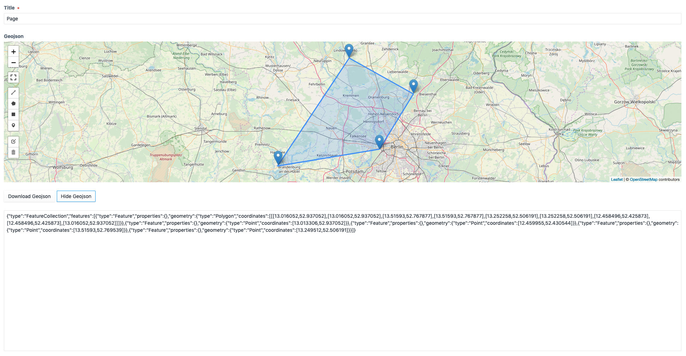

# geojsonmap plugin for Craft CMS 3.x

A craft cms 3 field plugin to draw Leaflet Maps.

## Requirements

This plugin requires Craft CMS 3.0.0-beta.23 or later.

## Installation

To install the plugin, follow these instructions.

1. Open your terminal and go to your Craft project:

        cd /path/to/project

2. Then tell Composer to load the plugin:

        composer require vardump/geojsonmap

3. In the Control Panel, go to Settings → Plugins and click the “Install” button for geojsonmap.

Brought to you by [vardump.de](https://vardump.de)
